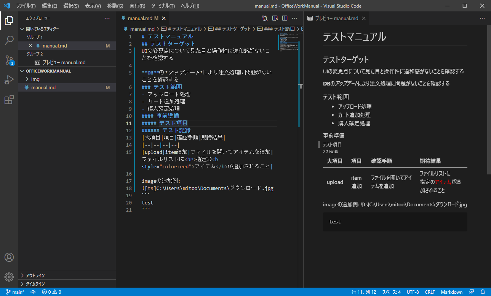

# テストマニュアル
## テストターゲット
UIの変更点について見た目と操作性に違和感がないことを確認する

**DB**の*アップデート*により注文処理に問題がないことを確認する
### テスト範囲
- アップロード処理
- カート追加処理
- 購入確定処理
#### 事前準備
##### テスト項目
###### テスト記録
|大項目|項目|確認手順|期待結果|
|--|--|--|--|
|upload|item追加|ファイルを開いてアイテムを追加|ファイルリストに<br>指定の<b style="color:red">アイテム</b>が追加されること|

imageの追加例:

```
test
```